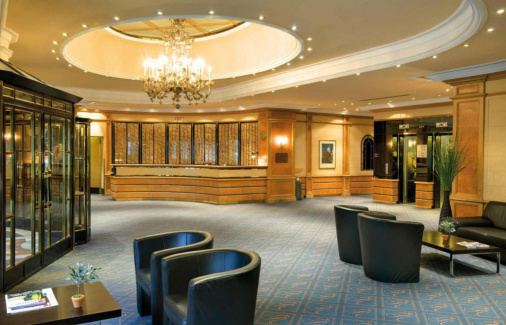
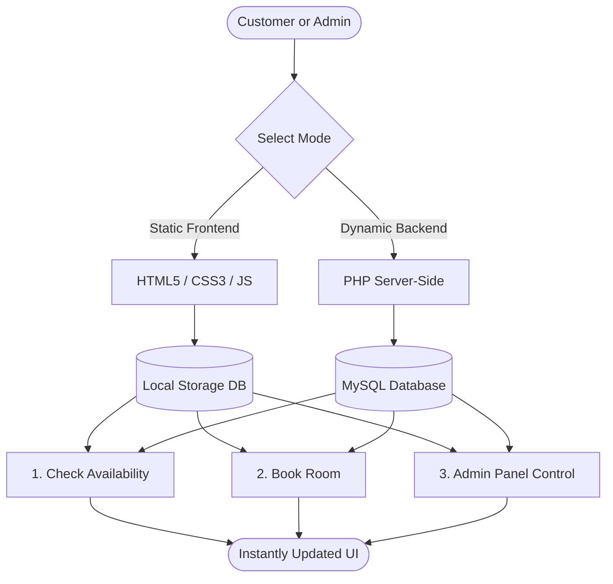

# 🏨 Grand Horizon - Online Hotel Booking & Management System


<div align="center">

[](LICENSE)
[](https://www.php.net/)
[](https://www.mysql.com/)
[](#)

*A luxury hotel booking experience engineered with dual architectures: traditional PHP/MySQL and fully serverless HTML5/LocalStorage.*

</div>

---

## 📸 Room Gallery & Previews

Experience the luxurious accommodations offered at Grand Horizon:

| 🛌 Duplex Suite | 👨‍👩‍👧‍👦 Family Room |
|:---:|:---:|
|  |  |
| *Modern duplex living starting at 1,500 tk/night.* | *Spacious comfort starting at 3,500 tk/night.* |

| 🌟 Super Comfort Suite | 🛋️ Lounge & Facilities |
|:---:|:---:|
|  |  |
| *Relaxing comfort starting at 2,200 tk/night.* | *Enjoy premium wifi, room service, and AC.* |

---

## 🗺️ System Workflow & Architecture

The following diagram illustrates how customer check-ins and admin modifications route through both the local database (HTML/JS) and the relational database (PHP/MySQL):



---

## ⚡ Dual-Architecture Configuration

Choose the architecture that suits your deployment environment:

### 🌐 1. Static Client-Side Mode
- **Database Engine**: Simulated via object-relational mapping inside `localStorage` in [js/db.js](js/db.js).
- **Session Manager**: Tracked using `sessionStorage`.
- **Hosting Compatibilities**: GitHub Pages, Vercel, Netlify, Cloudflare Pages.
- **Why use it**: Zero configuration needed. Just double-click the files to test.

### 🐘 2. PHP / MySQL Server-Side Mode
- **Database Engine**: Relational schema running on MySQL/MariaDB database server.
- **Session Manager**: Native server-side PHP session cache.
- **Hosting Compatibilities**: Apache, XAMPP, WAMP, IIS, or shared Linux hosts.
- **Why use it**: Standard database-backed persistent operations.

---

## 🛠️ Technology Stack Grid

<div align="center">

| Technology | Frontend Badges | Backend Badges |
| :--- | :--- | :--- |
| **Core Languages** |    |  |
| **Libraries & Frameworks** |   | MySQLi Object API |
| **Database Systems** | LocalStorage API |  |

</div>

---

## 📂 Project Directory Structure

```text
hotel-booking/
├── admin/                     # Administrator Pages
│   ├── css/                   # Styles for login/registration
│   ├── addroom.html           # HTML: Add room category
│   ├── addroom.php            # PHP: Add room category
│   ├── edit_room_cat.html     # HTML: Modify room properties
│   ├── edit_room_cat.php      # PHP: Modify room properties
│   ├── login.html             # HTML: Administrator authentication
│   ├── login.php              # PHP: Administrator authentication
│   ├── registration.html      # HTML: Manager registration
│   ├── registration.php       # PHP: Manager registration
│   └── include/               # Database core PHP classes & credentials config
│       ├── class.user.php
│       └── db_config.php
├── css/                       # Bootstrap stylesheet dependencies
├── fonts/                     # Font icon sets
├── images/                    # Room galleries and icons
├── js/                        # Local JavaScript files
│   └── db.js                  # Simulated LocalStorage Database script
├── index.html                 # HTML Entry Point
├── index.php                  # PHP Entry Point
├── room.html / room.php       # Room facility browsers
├── reservation.html / .php    # Availability query grids
├── booknow.html / .php        # Booking confirmation processors
├── hotel.sql                  # Main MySQL Schema file
└── README.md                  # System Documentation
```

---

## 🚀 Setup & Launch Instructions

> [!TIP]
> **LocalStorage Persistence**: Browser storage persists even if you reload the tab. If you want to reset your mock database back to default seed records, simply clear your browser's site cookies/local storage data or run `localStorage.clear()` in the inspector console.

### Running in Client-Side Mode (HTML)
1. Clone the repository:
   ```bash
   git clone https://github.com/vijaymahes9080/hotel-booking_php.git
   ```
2. Simply double-click on [index.html](index.html) in your browser.

### Running in Server-Side Mode (PHP)
1. Place the project folder inside your local web server's root directory (e.g., `C:/xampp/htdocs/hotel-booking/`).
2. Open `http://localhost/phpmyadmin/`.
3. Create a database named `hotel`.
4. Import the database schema from [hotel.sql](hotel.sql).
5. Edit database credentials inside [admin/include/db_config.php](admin/include/db_config.php).
6. Enable Apache & MySQL inside the XAMPP Control Panel, then navigate to `http://localhost/hotel-booking/index.php`.

---

## 🔑 Default Credentials

Use these credentials to log in to the Administrator Panel:

- **Primary Administrator**:
  - **Username**: `admin`
  - **Password**: `1234`
- **Assigned Manager**:
  - **Username**: `jinat`
  - **Password**: `jinat`

---

## 🔒 Security Notice

> [!WARNING]
> In PHP mode, this educational project utilizes standard string variables without statement parameters or bcrypt hashing. Do not host the PHP files on public production web servers without updating the code logic to prepared PDO statements and password encryptors.

---

## 📬 Contact & Support

Maintainer: **Vijay Mahes**  
GitHub: [@vijaymahes9080](https://github.com/vijaymahes9080)  
Email: [vijaymahes9080@gmail.com](mailto:vijaymahes9080@gmail.com)  
